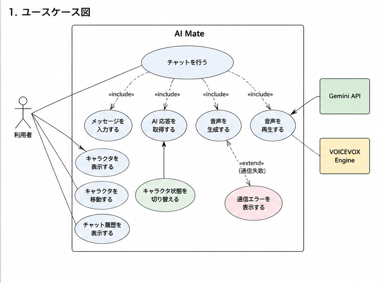
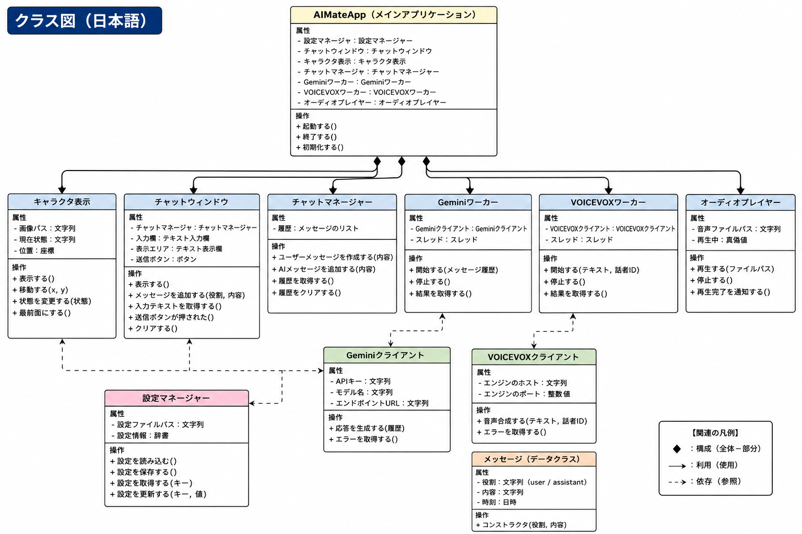
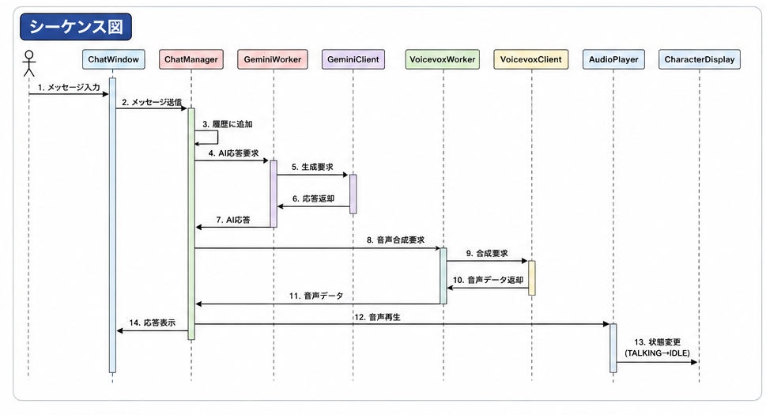
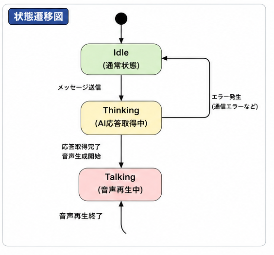

# AI mate

# 目次

・概要

・システム概要

・使用技術

・機能一覧

・操作説明

・機能要求

・非機能要求

・設計図

・テスト結果

## 概要

パソコン画面上に​親近感の​ある​オブジェクトを​配置する．​AIに​紐づいた​チャット機能を​有する．​

## システム概要

| 項目   | 内容              |
| ---- | --------------- |
| OS   | Windows         |
| 開発期間 | 約4週間            |
| 開発人数 | 1人              |
| 入力   | テキスト            |
| 出力   | チャット・キャラクタ表示・音声 |
​
## 使用技術

| 分類      | 使用技術            |
| ------- | --------------- |
| 言語      | Python 3        |
| GUI     | PySide6         |
| 生成AI    | Gemini API      |
| 音声合成    | VOICEVOX Engine |
| 通信      | requests        |
| キャラクタ表示 | GIF画像           |
## 非目標

・音声入力

・スケジュール機能

・複数キャラクタ管理

・長期記憶

・感情モデル

・クラウド同期

​・モバイル対応

・認証機能

## 機能一覧

### コア機能

・キャラクタ表示

・テキストチャット

・Gemini APIによる応答生成

・チャット履歴表示

・音声合成

・音声再生

・キャラクタ状態切り替え

### サポート機能

・キャラクタ移動

・最前面表示

・応答中アニメーション

### 共通機能

・API機能

・VOICEVOX通信

・エラーハンドリング

・設定ファイル管理

## 操作説明

### 起動方法

1　AI-Mateフォルダ内のmain.pyファイルをpython main.py等で実行する

2　キャラクターがデスクトップ上に表示される

3　VOICEVOX Engineが起動されていない場合，自動的に起動する

### 基本操作

| 操作    | 説明                  |
| ----- | ------------------- |
| 左クリック | チャットウィンドウを表示・非表示にする |
| ドラッグ  | キャラクターを任意の位置へ移動する   |
| 右クリック | メニューを表示し、アプリを終了する   |

### チャット機能

1　チャットウィンドウにメッセージを入力する

2　Enterキーまたは送信ボタンで送信する

3　Gemini APIが応答を生成する

4　応答内容がチャット欄に表示される

5　応答内容がVOICEVOXによって音声として再生される

### キャラクター状態

| 状態       | 説明             |
| -------- | -------------- |
| IDLE     | 待機状態           |
| THINKING | AIが応答を生成している状態 |
| TALKING  | 音声を再生している状態    |

## 機能要求

FR-01　キャラクタ表示機能　キャラクタ画像を​デスクトップ上に​表示する
​

FR-02　チャット入力機能　ユーザーが​テキストメッセージを​入力できる
​

FR-03　AI応答生成機能　ユーザーの​入力を​AIへ​送信し，​応答を​取得する
​

FR-04　チャット表示・履歴表示機能　AIの​応答メッセージを​画面上に​表示し、​会話履歴を​確認できる。​

FR-05　音声合成機能　AIの​応答を​VoiceVoxで​音声化する
​

FR-06　音声再生機能　生成した​音声を​再生する​

## 非機能要求

### 1.性能

NFR-P-01　​応答性能　AI応答取得開始まで​1秒以内である​こと

NFR-P-02　音声​再生性能　AI応答取得後，​5秒以内に​音声再生を​開始する​こと

NFR-P-03　​動作性能　キャラクタ​表示や​チャット操作時に​画面遅延が​発生しない​こと​

NFR-P-04　リソース使用料　通常利用​時に​過度な​CPU・メモリ消費を​発生させない​こと​

NFR-P-05　AI通信および音声生成処理は別スレッドで実行し、GUI操作を停止させないこと

### 2.セキュリティ

NFR-S-01　APIキー保護　APIキーを​ソースコードに​直接記述しない​こと
​

NFR-S-02　通信保護　AIサービスとの​通信に​HTTPSを​使用する​こと

NFR-S-03　入力値処理　ユーザー入力に​より​アプリケーションが​異常終了しない​こと​

NFR-S-04　ローカル保存　会話の​内容や​設定情報は​ユーザーの​許可なく​外部​へ​送信しない​こと​

### 3.ユーザビリティ

NFR-U-01　操作​容易性　説明なしで​チャットを​開始できる​こと

NFR-U-02　​視認性　チャット内容，​キャラ状態が​容易に​識別できる​こと

NFR-U-03　キャラクタ配置　任意の​位置に​キャラクタを​移動させられる​こと

### 4.​保守性

NFR-M-01　モジュール分割　GUI，​AI通信，​音声処理を​独立した​モジュールで​実装する​こと．

NFR-M-02　設定管理　APIキーや​音声設定を​設定ファイルから​変更できる​こと．

NFR-M-03　ログ出力　エラー発生時に​原因調査が​できる​ログを​出力する​こと．

NFR-M-04　外部​サービス変更への​対応　VoiceVox等の​変更時に​他モジュールへの​影響を​最小化する​構造と​する​こと．

## 設計図

## ユースケース図

## クラス図

## シーケンス図

## 状態遷移図

## テスト結果

### テスト概要

・テストケース数：24件

・正常系：15件

・境界値：5件

・異常系：4件

| 項目  |    結果   |
| --- | :-----: |
| 正常系 | 15 / 15 |
| 境界値 |  5 / 5  |
| 異常系 |  4 / 4  |
| 合計  | 24 / 24 |

## テストケース
|  # | テスト対象        | テスト観点(正常/境界/異常) | テスト条件                  | テスト手順(1行)                        | 期待値(1行)                 | 結果(○/ ) |
| -: | ------------ | --------------- | ---------------------- | -------------------------------- | ----------------------- | ------- |
|  1 | キャラクタ表示      | 正常              | アプリを通常起動できる            | アプリを起動する                         | キャラクタがデスクトップ上に表示される     |〇         |
|  2 | キャラクタ位置移動    | 正常              | キャラクタ表示中               | キャラクタをドラッグして任意の場所へ移動する           | キャラクタがドラッグした位置へ移動する     |〇         |
|  3 | 最前面表示        | 正常              | 他のウィンドウを開いている          | メモ帳などを開いた後にアプリを表示する              | キャラクタが他ウィンドウより前面に表示される  |〇         |
|  4 | チャット入力       | 正常              | チャット画面が表示されている         | 「こんにちは」と入力して送信する                 | 入力内容が送信される              |〇         |
|  5 | AI応答生成       | 正常              | Gemini APIが利用可能        | 「今日の天気は？」と送信する                   | AIから応答が返る               |〇         |
|  6 | チャット履歴表示     | 正常              | 2回以上会話済み               | 2回連続で質問を送信する                     | 過去の会話を含めて履歴が表示される       |〇         |
|  7 | 音声合成         | 正常              | VoiceVox Engineが起動している | AI応答を受信する                        | 応答内容の音声データが生成される        |〇         |
|  8 | 音声再生         | 正常              | 音声生成済み                 | AI応答を受信する                        | 音声が再生される                |〇         |
|  9 | キャラクタ状態切替    | 正常              | AI応答待ち状態になる            | メッセージを送信して応答を待つ                  | キャラクタ表示が応答中の状態へ切り替わる    |〇         |
| 10 | キャラクタ状態切替    | 正常              | AI応答完了                 | AI応答と音声再生が完了するまで待つ               | キャラクタ表示が通常状態へ戻る         |〇         |
| 11 | GUI応答性       | 正常              | AI応答待ち                 | メッセージ送信後にキャラクタをドラッグする            | GUIが停止せずキャラクタを移動できる     |〇         |
| 12 | 応答開始時間       | 正常              | 通信環境が正常                | メッセージ送信後に応答開始までの時間を測定する          | 約1秒以内に応答取得を開始する         |〇         |
| 13 | 音声再生開始時間     | 正常              | VoiceVox Engineが起動している | AI応答受信後に音声再生開始までの時間を測定する         | 約5秒以内に音声再生が始まる          |〇         |
| 14 | 文字入力         | 境界              | 入力欄が空                  | 何も入力せず送信ボタンを押す                   | 空メッセージは送信されず異常終了しない     |〇         |
| 15 | 文字入力         | 境界              | 1文字入力                  | 「あ」を入力して送信する                     | 正常に送信・応答される             |〇         |
| 16 | 文字入力         | 境界              | 長文入力                   | 入力欄へ非常に長い文章を貼り付けて送信する            | アプリが異常終了せず処理される         |〇         |
| 17 | チャット履歴       | 境界              | 会話が1件のみ                | メッセージを1回だけ送信する                   | 履歴に1件のみ表示される            |〇         |
| 18 | キャラクタ移動      | 境界              | キャラクタを画面端へ移動           | キャラクタを画面左上または右下までドラッグする          | キャラクタ操作が継続でき表示が崩れない     |〇         |
| 19 | AI通信         | 異常    | インターネット切断 | ネットワークを切断してからメッセージを送信する        | 通信エラーであることが表示され、アプリは継続して利用できる                |〇
| 20 | チャット送信 | 正常    | 連続して利用する   | 異なる内容のメッセージを5回連続で送信する    | すべて正常に応答し、履歴が正しく表示される |〇
| 21 | Gemini API設定 | 異常    | APIキーが無効  | 設定ファイルのAPIキーを誤った値に変更してアプリを起動する | APIキーエラーとなり、アプリは起動しない                        |〇
| 22 | 音声再生   | 正常    | 複数回応答を受信する | メッセージを3回送信し、それぞれの応答を確認する | 毎回音声が正常に再生される         |〇
| 23 | チャット送信       | 異常              | 同一メッセージを連続送信           | 送信ボタンを素早く2回連続で押す                 | アプリがフリーズせず安全に処理される      |〇         |
| 24 | 入力値処理        | 異常              | 特殊文字を入力                | `!@#$%^&*()<>[]{}😀` を入力して送信する   | アプリが異常終了せず送信または適切に処理される |〇         |
